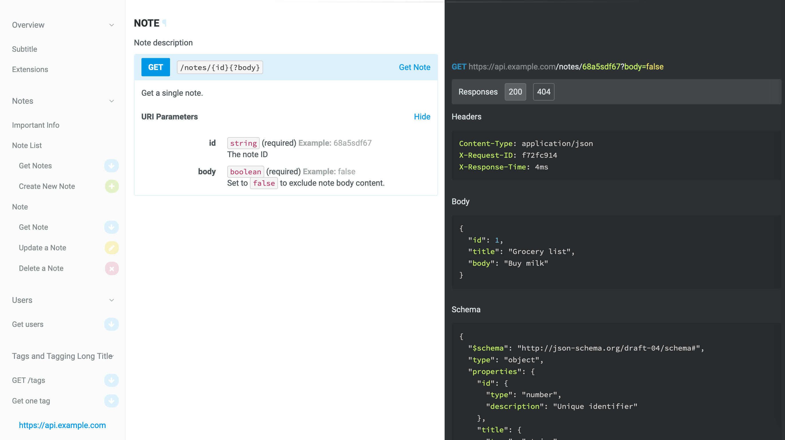

[](https://pypi.org/project/foliantcontrib.aglio/)  [](https://github.com/foliant-docs/foliantcontrib.aglio)

# Aglio Backend for Foliant



Aglio backend generates API documentation from [API Blueprint](https://apiblueprint.org/) using [aglio renderer](https://github.com/danielgtaylor/aglio).

This backend operates the `site` target.

> Note, that aglio is designed to render API Blueprint documents. Blueprint syntax is very close to that of Markdown and you may be tempted to use this backend as a general purpose static site generator. It may work in some cases, but is not guaranteed to work in all of them.

## Installation

```bash
$ pip install foliantcontrib.aglio
```

To use this backend [Aglio should be installed](https://github.com/danielgtaylor/aglio#installation--usage) on your system:

```bash
$ npm install -g aglio
```

To test if you've installed aglio properly run the `aglio -h` command, which should return you a list of options.

## Usage

To generate a static website from your Foliant project run the following command:

```bash
$ foliant make site --with aglio
Parsing config... Done
Applying preprocessor flatten... Done
Applying preprocessor _unescape... Done
Making site... Done
────────────────────
Result: My_Awesome_Project.aglio
```

## Config

You don't have to put anything in the config to use aglio backend. If it's installed, Foliant detects it.

To customize the output, use options in `backend_config.aglio` section:

```yaml
backend_config:
  aglio:
    aglio_path: aglio
    params:
        theme-variables: flatly
        fullWidth: True
```

`aglio_path`
:   Path to the aglio binary. Default: `aglio`

`params`
:   Parameters which will be supplied to the `aglio` command. To get the list of possible parameters, run `aglio -h` or check the [official docs](https://github.com/danielgtaylor/aglio#installation--usage).

## Customizing output

### Templates

You can customize the appearance of the static website build by aglio with [Jade](http://jade-lang.com/) templates. Aglio has two built-in templates:

* `default` — two-column web-page;
* `triple` — three-column web-page.

To add your own template, follow [the instructions](https://github.com/danielgtaylor/aglio#customizing-layout-templates) in the official docs.

To specify the template add the `theme-template` field to the `params` option:

```yaml
backend_config:
  aglio:
    params:
        theme-template: triple
```

### Color scheme

You can customize the color scheme of the website by specifying the color scheme name in `theme-variables` param.

Available built-in color schemes:

* `default`,
* `cyborg`,
* `flatly`,
* `slate`,
* `streak`.

You can also specify your own scheme in a LESS or CSS file.

```yaml
backend_config:
  aglio:
    params:
        theme-variables: flatly
```

### Stylesheets

Finally, you can provide custom stylesheets in a LESS or CSS file in `theme-style` param:

```yaml
backend_config:
  aglio:
    params:
        theme-style: !path my-style.less
```
